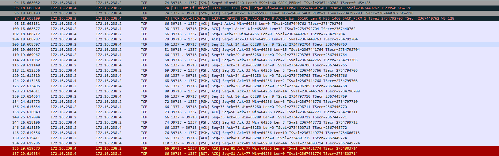

<h1 align='center'>CS-hAcked?<br>60</h1>

<p>
 
Dear fellow, we've heard you've got some hacking skills - this is the time to use them ;)
For some time now we've been investing great efforts to get a hold of an extremely dangerous hacking team network that goes by the name "CS-hAcked". 
According to our intelligence, we believe that on this network they transfer their secret combination  - being used as a trigger to every major attack they commit.
Recently we've come to a major breakthrough, successfully completing an operation to achieve remote control on one of the computers in the network.
That's where you get into the picture.

</p><p>
Your mission, should you choose to accept it, is to infiltrate their network using our implanted backdoor,
and reveal once and for all the secret combination to finally get the secret flag.
</p>

<p>

Thanks to our dedicated intelligence researchers we gathered the following information for you that might assist you:
1. We know the dictionary of words they've used over time. It's highly probable they'll use it for their current combination.
2. Our backdoor PC credentials - IP: 3.126.154.76 , port:2222, username:csa, pass:123123
3. The flag server IP: 3.126.154.76  port: 80
 
And perhaps the following could help you as well:
* https://en.wikipedia.org/wiki/Man-in-the-middle_attack
* https://www.techrepublic.com/article/how-to-scan-for-ip-addresses-on-your-network-with-linux/
* https://en.wikipedia.org/wiki/ARP_spoofing

 </p><p>
 
As always, should you or any of your members be caught or hacked, the secretary will disavow any knowledge of your actions. 
This page will self-destruct in few weeks.

</p><p>
 Good Luck! </p>
___


<p>

We are told to perform a Man In The Middle Attack in order to get a secret combination.
 
</p>

<details>
  <summary>Solution</summary>
  <p>
  
  First of all, I started with inspecting the backdoor server via ssh to see what I can get from there, 
  there, we do not have access to most linux commands, but I found that the commands `tcpdump`, `nmap` and `arpspoof` 
  are available. So I started to look for any servers/devices on the network, there are two networks; `192.168.112.0/20`
  on interface `eth0` and `172.16.238.0/24` on interface `eth1`.
  
  </p>
  <p>
  
  The interface `eth0` is less interesting, but on the second one, I found two interesting machines:
  * Ubuntu Server on ip `172.16.238.2`
  * Ubuntu Client on ip `172.16.238.4`
  
  </p><p>
  
  So, I wanted to see if there are any interesting traffic going between them, using the command `arpspoof -i eth1 -r -t 172.16.238.4 172.16.238.2`
  to perform a MITM between the two Ubuntu machines, and I found an interesting traffic going between them on port `1337`:
  </p>
  
  <center> </center>
  
  <p>
  
  With hex dump:  
  
  ```
    00000000  59 6e 2b 00 b3 49 e7 8d  e0 cc 58 6e 45 82 c8 d7   Yn+..I.. ..XnE...
    00000010  0e 60 27 f7 6a f0 22 0d  a7 a3 1e 33 76 44 7c bb   .`'.j.". ...3vD|.
00000000  b7 5a a7 53 7b 30 6a 86  39 17 33 e2 e6            .Z.S{0j. 9.3..
0000000D  6e d1 01 ee 76 15 5f fc  90 da 9f b0 5c f5 bb      n...v._. ....\..
0000001C  d5 1f                                              ..
0000001E  49 4c 13                                           IL.
00000021  ba c2                                              ..
00000023  34 1b 5e be 22 cd 43 2c  4a 79 94 d4 bc 4a         4.^.".C, Jy...J
00000031  3e 32 17 f7 e1 10                                  >2....
00000037  75 ef bf 54 55 7c ed                               u..TU|.
0000003E  4b bd 1e eb c0 33 fc 30                            K....3.0 
00000046  bf fd d8 b8 1f 0c 9c 96  f0 55                     ........ .U
    00000020  ea 02 6b bc be 0b f2 19  e6 95 ec 22 a7 9b 38 4f   ..k..... ..."..8O
    00000030  6c 43 df 2d b1 f7 df 12  67 bf 7a 34 09 91 07 78   lC.-.... g.z4...x
    00000040  df 09 d4 2d 55 16 55 6b  36 23 d5 ec               ...-U.Uk 6#..
```
  
  </p>
  
  <p>
  
  Now inspecting the flag server, when connecting, we receive an RC4 key: `csa-mitm-key` and then `32` bytes, 
  when decrypting those bytes using the RC4 key, we get the message: `Hi! what's the secret sequence?\n`.
  
  <br/>
   
  If I send something to server, the server disconnects. And if I waited long enough, the server sends something when
  decrypted using RC4, it gives `Time is up!\n`, so we need to send something specific to the server in order to receive
  the flag (the secret combination).
  
  </p>
  <p>
  
  I noticed that the tcp packets I sniffed follow the same patters, the Ubuntu server sends 32 bytes to the client 
  (must be the welcome message), then the client replies with 10 words (must be the secret combination),
  and finally the server replies with 44 bytes (must be the encrypted flag).
  
  </p><p>
  
  Assuming that the 10 packets the Ubuntu client sends to the server are the secret combination, and since the RC4 does
  not change the length of the encrypted text we know the lengths of all the words in the combination.</br>
  
  Applying that, I managed to reduce the amount of combinations from the given dictionary to 48 different combinations,
  and trying them one-by-one I found the correct combination is:<br/>
  
  ```particularly administration a as I environmental about across ability according```
  
  <br/>
  
  Sending that to the flag server (encrypted using RC4) the server returns the encrypted flag that when decrypted, it gives <br/>
  
    `CSA{i_gu355_I_need_tO_ChN4GE_mY_encrYp71On}`
    
    
  </p>
</details>
