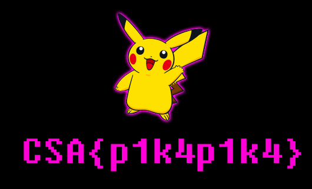

<h1 align='center'>Shoes 80</h1>

Hi Ash! We have found Team Rocket's secret server. 
We have a good feeling that there is a hidden message inside it, and you have to find it. In order to help you, we have managed to get a PCAP from someone who had access to the server in the past, we hope you find it useful.

In addition, we have discovered an email that may be connected. All of the files are safe for download, don't worry.

Good luck!

___

Here we have a network capture file and a pdf containing an email, we need to figure out the communication protocol in 
order to receive the flag.

  
Solution

  

  
  First by inspecting the pdf file, I can understand that they have an implementation of a network communication
  protocol and they are using some kind of a checksum that is standard.
  
  

  

  
  By inspecting the WireShark capture file I can see some traffic, but there is an interesting traffic between 
  the ip `10.0.2.15` (local machine) and an external ip address `52.28.255.56` (the server), this conversation is shown two times,
  the conversation between them goes as follows:
  
  1. The local machine sends an initial message.
  2. The server replies with a message containing random characters every time.
  3. The local machine send a reply to the server (depends on the message from the server).
  4. The local machine send another message to the server.
  5. The server sends back a message that looks like the local machine's message.
  6. The local machine sends a GET request to the server.
  7. The server sends a GET response.
  
  

  

  
  Investigating the various messages between the server and the local machine, I noticed that all the messages do start
  with the byte `0x5a`, and I also found out that the last 4 bytes
  are representing the CRC32 checksum (little endian) of the entire message (except the checksum itself of course),
  and also the first message we receive from the server, I shall call it the challenge, is consisting apart from the checksum
  and the header byte of exactly 4 bytes, the first byte seems to be from the initial message, the second byte is 
  random every time (I'll call it random byte), and the 3 last bytes are also random every time (I'll call them the secret).
  
  

  
  By inspecting the response from the local machine's response, the response consists of (apart from the header byte and the checksum) 
  exactly 4 bytes, the first of which, is the random byte from the challenge, and the other 3 bytes seems to be random,
  but by xor-ing them with the secret from the challenge I always get `CSA` as a result.
  
   
  
  The third message from the local machine contains an ip address, seems to be to send the GET request to.
  
  

 
  
  So, to summarize the protocol:
  1. The client initiate the transaction.
  2. The server sends a challenge to authenticate the client.
  3. The client sends a response to that challenge by xor-ing the secret with `CSA`.
  4. The client sends an ip address to forward the GET request to.
  5. The server confirms that ip address.
  6. The client sends a GET request.
  7. The server returns the GET response.
  
  All the message from 1 to 5 need to have a CRC32 checksum in their end.
  

  
  By following the protocol described above, I managed to communicate with the server and send any GET request I wanted,
  so by requesting the file `Flag.jpg` I received this image:
  
   
  
  
  
  And receiving the flag: 
  
  `CSA{p1k4p1k4}`
  
   

  
  

  
  How to use: 
  
  `python3 solver.py <filename=Flag.jpg>`
  
  

